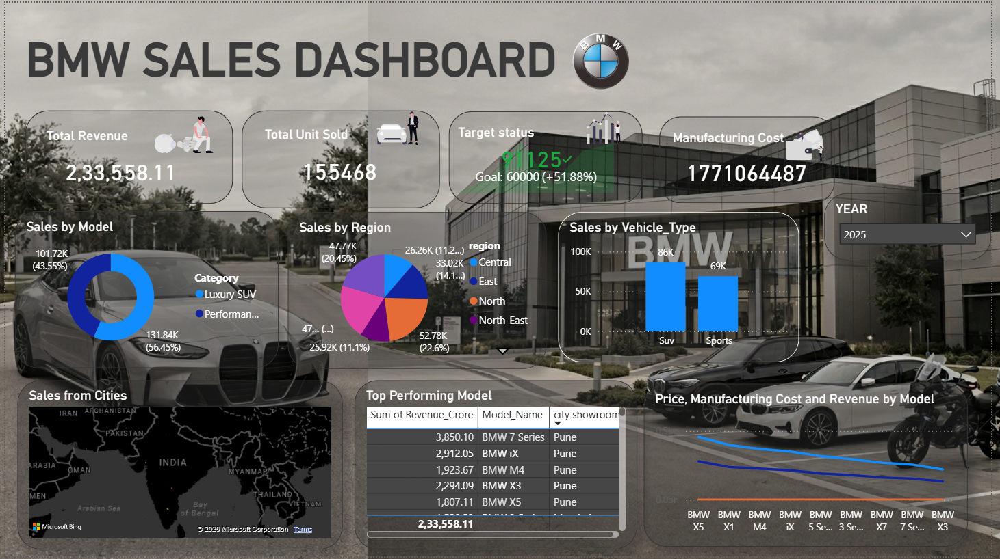

# 🚗 BMW India Sales Dashboard

An interactive Power BI dashboard developed to analyze BMW vehicle sales performance across India. The dashboard provides insights into revenue generation, sales distribution, manufacturing costs, regional performance, and top-selling BMW models to support business decision-making.



---

## 📊 Project Overview

The BMW India Sales Dashboard offers a comprehensive view of sales operations across major Indian cities and regions. It enables stakeholders to monitor key performance indicators, identify high-performing markets, and evaluate product performance.

### Dashboard Highlights

* Revenue Analysis
* Vehicle Sales Performance
* Target Achievement Monitoring
* Manufacturing Cost Analysis
* Model-wise Sales Distribution
* Region-wise Sales Performance
* Vehicle Segment Analysis
* City-wise Sales Mapping
* Top Performing Models
* Revenue vs Manufacturing Cost Comparison

---

## 🎯 Key Performance Indicators (KPIs)

| KPI                | Value          |
| ------------------ | -------------- |
| Total Revenue      | ₹23.36 Billion |
| Total Units Sold   | 155,468        |
| Target Achievement | 91,125 Units   |
| Manufacturing Cost | ₹17.71 Billion |

---

## 📌 Dashboard Features

### Revenue Overview

Tracks total revenue generated from BMW vehicle sales across India.

### Unit Sales Analysis

Displays the total number of vehicles sold during the reporting period.

### Sales Target Monitoring

Measures actual sales performance against predefined business targets.

### Model-wise Sales Distribution

Visualizes the contribution of different BMW models to overall sales revenue.

### Regional Sales Analysis

Compares sales performance across Indian regions:

* North
* South
* East
* West
* Central
* North-East

### Vehicle Segment Analysis

Evaluates sales performance across vehicle categories such as:

* Luxury SUV
* Performance & Sports Vehicles

### City-wise Sales Insights

Geographical visualization of sales distribution across major Indian cities, including:

* Mumbai
* Pune
* Delhi NCR
* Bengaluru
* Hyderabad
* Chennai
* Kolkata

### Top Performing Models

Identifies BMW models generating the highest revenue and sales volume.

### Cost vs Revenue Analysis

Compares vehicle pricing, manufacturing costs, and revenue generated across different BMW models.

---

## 🛠️ Tools & Technologies

* Power BI Desktop
* Microsoft Excel
* Power Query
* DAX (Data Analysis Expressions)
* Data Modeling
* Interactive Visualizations

---

## 📂 Project Structure

```text
BMW-Sales-Dashboard/
│
├── Dashboard.pbix
├── Dataset/
│   └── BMW_Sales_Data.xlsx
│
├── Dashboard.png
│
└── README.md
```

---

## 📈 Key Business Insights

* Luxury SUV models contribute the highest share of total sales revenue.
* BMW X-Series vehicles are among the strongest revenue-generating products.
* Western and Southern regions demonstrate strong sales performance.
* Revenue significantly exceeds manufacturing costs, indicating healthy profitability.
* Sales targets have been exceeded by more than 50%, reflecting strong market demand.

---

## 🚀 Getting Started

### Clone the Repository

```bash
git clone https://github.com/karngaikwad60-pixel/BMW-Sales-Dashboard.git
```

### Open the Dashboard

1. Install Power BI Desktop.
2. Open the `Dashboard.pbix` file.
3. Refresh the data source if required.
4. Explore interactive reports and insights.

---

## 📸 Dashboard Preview

The dashboard provides a complete overview of BMW India's sales performance, enabling users to analyze revenue, costs, customer demand, and regional trends through interactive visualizations.

---

## 🔮 Future Enhancements

* Monthly and Quarterly Sales Trends
* Predictive Sales Forecasting
* Dealer Performance Analysis
* Customer Segmentation Dashboard
* Profit Margin Analysis
* Inventory Management Insights

---

## 👨‍💻 Author

**Karn Gaikwad**

GitHub: https://github.com/karngaikwad60-pixel

---

## ⭐ Support

If you found this project helpful, consider giving the repository a ⭐ on GitHub.
